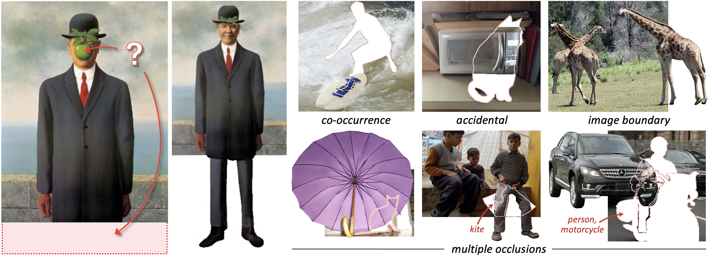

## Amodal Completion via Progressive Mixed Context Diffusion (CVPR 2024)
### [Project Page](https://k8xu.github.io/amodal/) | [Paper](https://arxiv.org/pdf/2312.15540.pdf) | [arXiv](https://arxiv.org/abs/2312.15540) | [Bibtex](#bibtex)

[Katherine Xu](https://k8xu.github.io)$^{1}$, [Lingzhi Zhang](https://owenzlz.github.io)$^{2}$, [Jianbo Shi](https://www.cis.upenn.edu/~jshi)$^1$<br>
$^1$ University of Pennsylvania, $^2$ Adobe Inc.


Our method can recover the hidden pixels of objects in diverse images. Occluders may be co-occurring (a person on a surfboard), accidental (a cat in front of a microwave), the image boundary (giraffe), or a combination of these scenarios.
The pink outline indicates an occluder object.

## 🚀 Updates
- Stay tuned for our code release!

<a name="bibtex"></a>
## Citation

If you find our work useful, please cite our paper:
```
@article{xu2023amodal,
    title={Amodal Completion via Progressive Mixed Context Diffusion},
    author={Xu, Katherine and Zhang, Lingzhi and Shi, Jianbo},
    journal={arXiv:2312.15540},
    year={2023}
}
```
